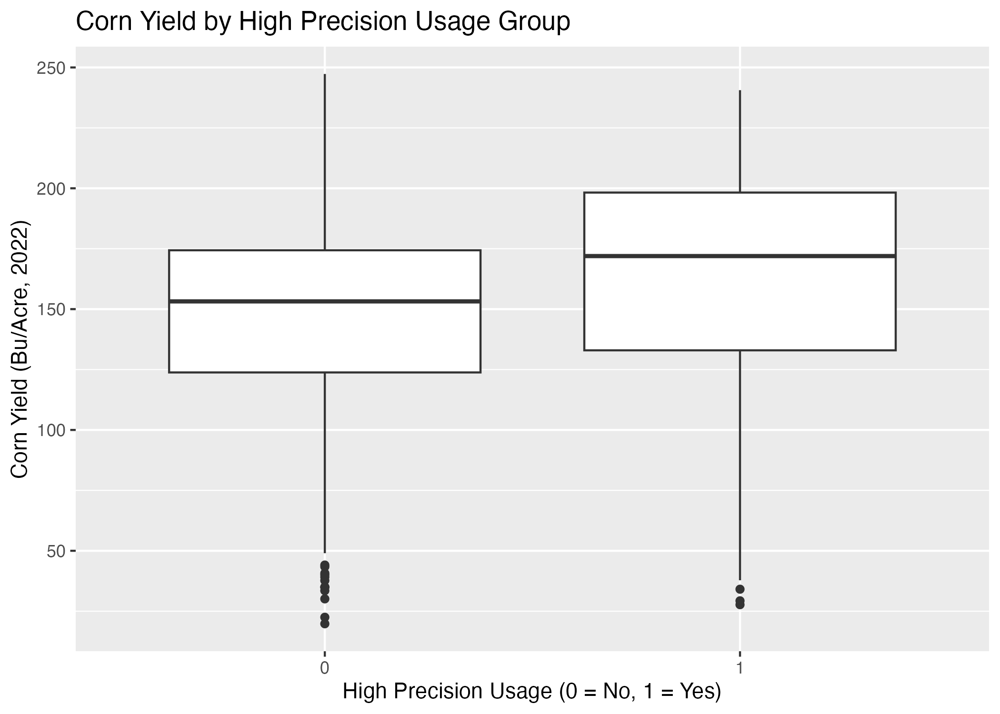
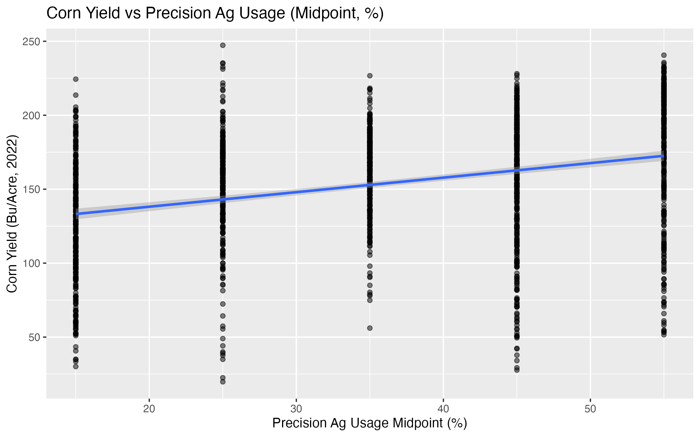
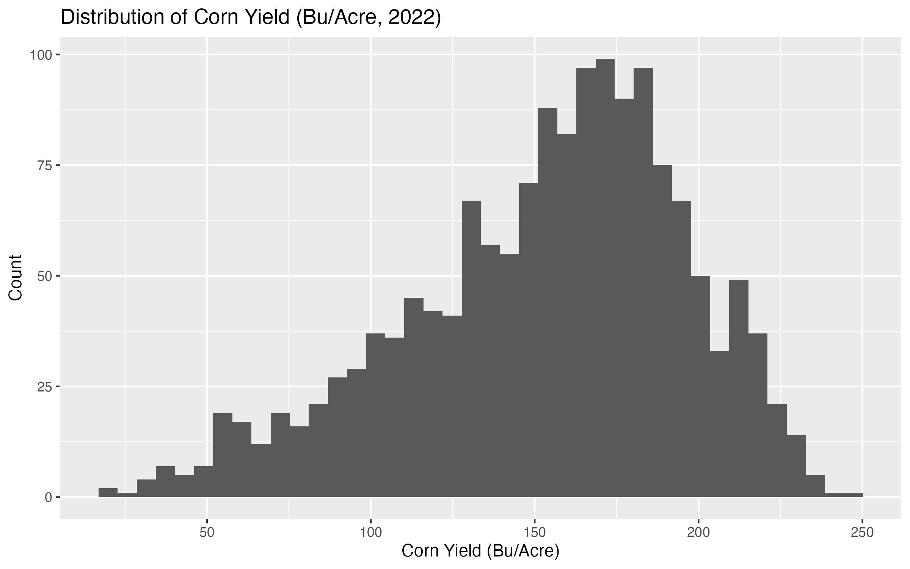

# precision-agriculture-corn-yields


## At-a-Glance (Results)
- **Question:** Is precision agriculture adoption associated with higher corn yields across U.S. counties?
- **Design:** Ecological (county-level) analysis — associative, not causal
- **Data:** Standardized county dataset (**n = 1,543**, 13 columns)
- **Headline finding (group comparison):**  
  Counties with **high_precision_usage = 1** average **162.95 bu/acre** vs **146.37 bu/acre** for **high_precision_usage = 0**  
  - **Difference:** **+16.58 bu/acre**  
  - **Welch t-test:** **p = 1.95e-13**  
  - **95% CI for (group0 − group1):** **[-20.95, -12.20]**
- **Regression (continuous adoption):**  
  Simple OLS: **+0.98 bu/acre** per **+1 pp** adoption; **R² = 0.101**; **p < 2e-16**
- **Proof artifacts:** figures in `output/figures/`, tables in `output/tables/`, full writeup PDF in `Report/`

**Key tables:**  
- `output/tables/ttest_yield_by_high_precision.csv`  
- `output/tables/model_m1_precision_midpoint.csv`  
- `output/tables/model_fit_summary.csv`

---

## Quickstart

1. Clone the repository  
2. Open the project root (recommended: RStudio)

### Run end-to-end
```bash
Rscript Analysis/PrecisionAGCornYields.R
```

### Validate outputs
```bash
ls -lah output/tables
ls -lah output/figures
```

## Visual Summary

### Yield distribution by adoption group


### Yield vs. precision adoption (midpoint %)


### Yield Histogram



## Report
- `Report/Precision Agriculture Adoption and Corn Yields in the United States ,An Ecological Analysis.pdf`

## Overview
This project analyzes the relationship between precision agriculture adoption and corn yields using publicly available U.S. government data.

The objective is to evaluate whether counties with higher adoption of precision agriculture technologies exhibit statistically different yield outcomes compared to counties with lower adoption. The analysis is ecological in nature and does not infer farm-level causality.

## Data
Data were compiled from U.S. government agricultural reports and infographics and standardized into a single structured CSV for analysis.

- Corn yield data: County-level yield outcomes (2022)
- Precision agriculture adoption indicators: Reported adoption measures (including a midpoint adoption estimate)

## Methods
- Data cleaning and standardization
- Exploratory data analysis
- Statistical comparison (two-sample t-tests)
- Exploratory regression modeling (simple and multivariable models)

All analysis was conducted in R.

```md
## Repository Structure
```text
precision-agriculture-corn-yields/
├─ Analysis/
│  └─ PrecisionAGCornYields.R
├─ Data/
│  └─ CornYieldsFinalizedDataSubmissionSheet(in) (1).csv
├─ Report/
│  └─ Precision Agriculture Adoption and Corn Yields in the United States ,An Ecological Analysis.pdf
├─ output/
│  ├─ tables/
│  └─ figures/
├─ README.md
├─ LICENSE
└─ .gitignore

## Notes & Limitations
- Ecological (county-level) analysis; results are associative, not causal.
- Some covariates contain missingness (models with controls drop observations).
- Follow-up work would require richer covariates and/or farm-level microdata.

## Author
Richard Anderson
